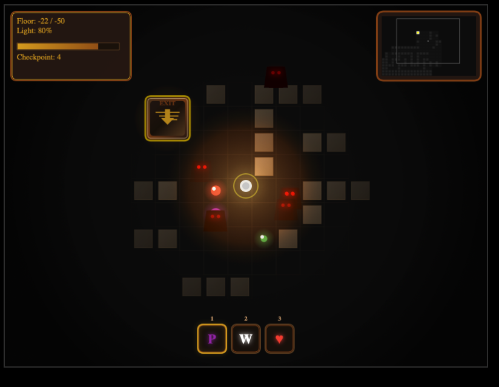

# Buried Spire Quest

[](LICENSE)
[](https://developer.mozilla.org/en-US/docs/Web/JavaScript)
[](https://developer.mozilla.org/en-US/docs/Web/API/Canvas_API)
[](https://albader94.github.io/maze-game-html/public/)

A 2D dungeon crawler survival game set in the ancient buried tower of Burj Mubarak. Descend 50 floors, manage your dwindling light, collect mystical orbs, and avoid deadly ghouls to find the legendary Pearl.



---

<details>
<summary>Table of Contents</summary>

- [Play Now](#play-now)
- [Features](#features)
- [Getting Started](#getting-started)
- [Fork and Firebase Setup](#fork-and-firebase-setup)
- [Controls](#controls)
- [Orb Types](#orb-types)
- [Tech Stack](#tech-stack)
- [Project Structure](#project-structure)
- [Contributing](#contributing)
- [License](#license)

</details>

---

## Play Now

**[Play Buried Spire Quest](https://albader94.github.io/maze-game-html/public/)** — runs directly in your browser, no install required.

You can also install it as a PWA for offline play — look for the install prompt in your browser.

## Features

**Gameplay**

- Procedural maze generation with unique layouts per floor
- Dynamic light system — your primary resource that constantly depletes
- 7 orb types with unique powers (phase through walls, reveal map, auto-revive, and more)
- 3-slot inventory for strategic orb management
- Ghoul AI with patrol, stalking, and aggressive behavior states
- Checkpoint system every 5 floors with death recovery
- Death markers (light wisps) that restore light where you fell

**Progression**

- 50 floors of increasing difficulty
- 10 achievements (First Steps, Speed Runner, Completionist, and more)
- Persistent statistics tracking across sessions
- Online leaderboard with anonymous authentication

**Technical**

- Mobile-responsive with virtual joystick and touch controls
- PWA with offline support via Service Worker
- Ambient sound system with contextual SFX
- 60 FPS with object pooling and spatial hash grid optimization

## Getting Started

### Prerequisites

- A modern web browser (Chrome, Firefox, Safari, Edge)
- [Node.js](https://nodejs.org/) >= 12.0.0 (optional, for dev server)
- Python 3 (optional, alternative dev server)

### Installation

```bash
git clone https://github.com/albader94/maze-game-html.git
cd maze-game-html
```

### Running Locally

**Option 1** — npm (uses Python HTTP server under the hood):

```bash
npm start
# Game available at http://localhost:8000/public/
```

**Option 2** — live-server (auto-reloads on file changes):

```bash
npm install
npm run dev
```

**Option 3** — just open the file:
Open `public/index.html` directly in your browser. Note: some features (PWA, audio) require a server.

## Fork and Firebase Setup

### Forking the Project

1. Click **Fork** on the [GitHub repository](https://github.com/albader94/maze-game-html)
2. Clone your fork:
   ```bash
   git clone https://github.com/YOUR_USERNAME/maze-game-html.git
   cd maze-game-html
   ```
3. Run the game locally with `npm start`
4. Create a branch for your changes:
   ```bash
   git checkout -b feature/your-feature
   ```

The game works fully without Firebase — the leaderboard simply disables itself when unconfigured.

### Firebase Setup (Optional — for Leaderboard)

To enable the online leaderboard on your fork:

1. **Create a Firebase project** at [console.firebase.google.com](https://console.firebase.google.com)

2. **Enable Anonymous Authentication**
   - Go to Authentication > Sign-in method
   - Enable the **Anonymous** provider

3. **Create a Cloud Firestore database**
   - Go to Firestore Database > Create database
   - Start in **production mode**

4. **Set Firestore security rules** — go to Firestore > Rules and paste:

   ```
   rules_version = '2';
   service cloud.firestore {
     match /databases/{database}/documents {
       match /leaderboard/{docId} {
         allow read: if true;
         allow create: if request.auth != null
                       && docId == request.auth.uid
                       && request.resource.data.keys().hasOnly(['name', 'deepestFloor', 'orbsCollected', 'timestamp', 'playerUID', 'completionTimeMs', 'deaths'])
                       && request.resource.data.playerUID == request.auth.uid
                       && request.resource.data.name is string
                       && request.resource.data.name.size() >= 1
                       && request.resource.data.name.size() <= 20
                       && request.resource.data.deepestFloor is number
                       && request.resource.data.deepestFloor >= 0
                       && request.resource.data.deepestFloor <= 200
                       && request.resource.data.orbsCollected is number
                       && request.resource.data.orbsCollected >= 0;
         allow update: if request.auth != null
                       && docId == request.auth.uid
                       && request.resource.data.keys().hasOnly(['name', 'deepestFloor', 'orbsCollected', 'timestamp', 'playerUID', 'completionTimeMs', 'deaths'])
                       && request.resource.data.playerUID == request.auth.uid
                       && request.resource.data.name is string
                       && request.resource.data.name.size() >= 1
                       && request.resource.data.name.size() <= 20
                       && request.resource.data.deepestFloor is number
                       && request.resource.data.deepestFloor >= 0
                       && request.resource.data.deepestFloor <= 200
                       && request.resource.data.deepestFloor >= resource.data.deepestFloor
                       && request.resource.data.orbsCollected is number
                       && request.resource.data.orbsCollected >= 0;
         allow delete: if false;
       }
     }
   }
   ```

5. **Register a Web app** in Project Settings > General > Your apps > Add app (Web)

6. **Copy the config** and replace the values in `src/js/leaderboard.js`:

   ```javascript
   const firebaseConfig = {
     apiKey: "YOUR_API_KEY",
     authDomain: "YOUR_PROJECT.firebaseapp.com",
     projectId: "YOUR_PROJECT_ID",
     storageBucket: "YOUR_PROJECT.appspot.com",
     messagingSenderId: "YOUR_SENDER_ID",
     appId: "YOUR_APP_ID",
   };
   ```

7. **Restrict your API key** in [Google Cloud Console](https://console.cloud.google.com/apis/credentials):
   - Set **HTTP referrer** restrictions to your deployment domain
   - Set **API restrictions** to only: Cloud Firestore API, Identity Toolkit API, Token Service API

> **Note:** Firebase web API keys are safe to include in client-side code — they identify your project, not grant access. Security is enforced by Firestore rules and Authentication settings.

## Controls

### Desktop

| Action            | Key                |
| ----------------- | ------------------ |
| Move              | WASD or Arrow Keys |
| Use inventory orb | 1, 2, 3            |
| Help              | H                  |
| Start game        | Space              |

### Mobile

| Action         | Control                        |
| -------------- | ------------------------------ |
| Move           | Virtual joystick (bottom-left) |
| Use orb / Help | Action buttons (bottom-right)  |
| Settings       | Gear icon                      |

## Orb Types

| Orb        | Symbol | Effect                            |
| ---------- | ------ | --------------------------------- |
| Blue Orb   | O      | Restores 15% light                |
| Golden Orb | @      | Restores 25% light                |
| Purple Orb | P      | Phase through walls (5s)          |
| Green Orb  | G      | Regenerate light (10s)            |
| White Orb  | W      | Reveal entire map (5s)            |
| Red Orb    | ♥      | Auto-revive at 0% light           |
| Light Wisp | \*     | Death marker — restores 50% light |

Blue and Golden orbs auto-collect on contact. Purple, Green, White, and Red orbs go into your 3-slot inventory for strategic use.

## Tech Stack

| Technology                | Purpose                                      |
| ------------------------- | -------------------------------------------- |
| HTML5 Canvas              | Game rendering (dual canvas: game + minimap) |
| Vanilla JavaScript (ES6+) | Game logic across 16 modules                 |
| CSS3                      | Responsive layout with media queries         |
| Firebase 10.14            | Leaderboard (Firestore + Anonymous Auth)     |
| Service Worker            | PWA offline support                          |
| Web Audio API             | Sound effects and ambient audio              |

No build tools or bundlers — pure vanilla web technologies.

## Project Structure

```
maze-game-html/
├── public/
│   ├── index.html        # Entry point
│   ├── manifest.json     # PWA manifest
│   ├── sw.js             # Service Worker
│   └── icon-*.png        # App icons
├── src/
│   ├── css/
│   │   ├── styles.css    # Base styles, canvas, responsive
│   │   └── ui.css        # UI element styles
│   └── js/
│       ├── config.js     # Game constants and orb definitions
│       ├── gameState.js  # State management and persistence
│       ├── gameLogic.js  # Main controller and update loop
│       ├── main.js       # Initialization, settings, debug tools
│       ├── entities.js   # Player, ghouls, orbs, collision
│       ├── renderer.js   # Canvas drawing, HUD, minimap, effects
│       ├── mapGenerator.js # Procedural maze generation
│       ├── input.js      # Keyboard, mouse, touch input
│       ├── inventory.js  # Orb collection and usage
│       ├── tutorial.js   # Step-based tutorial system
│       ├── leaderboard.js # Firebase leaderboard
│       ├── soundManager.js # Audio system
│       ├── messages.js   # Story narration and game messages
│       ├── storyNarration.js # Narrative text and callbacks
│       ├── utils.js      # Particles, collision helpers, pooling
│       └── pwa.js        # Service Worker registration
├── assets/
│   └── sound/            # Audio files
├── CHANGELOG.md
├── CLAUDE.md
├── LICENSE
└── package.json
```

## Contributing

1. Fork the repository
2. Create a feature branch: `git checkout -b feature/your-feature`
3. Make your changes and test across desktop and mobile
4. Commit with a clear message describing the change
5. Push to your fork and open a Pull Request against `main`

### Where to Start

| Want to...             | Modify                                             |
| ---------------------- | -------------------------------------------------- |
| Add a new orb type     | `config.js` (definition) + `inventory.js` (effect) |
| Add a new entity       | `entities.js` (behavior) + `renderer.js` (drawing) |
| Change game balance    | `config.js`                                        |
| Add UI elements        | `renderer.js` + `src/css/`                         |
| Modify maze generation | `mapGenerator.js`                                  |

## License

This project is licensed under the [MIT License](LICENSE).

## Acknowledgments

- Built with vanilla JavaScript and HTML5 Canvas
- Leaderboard powered by [Firebase](https://firebase.google.com/)
